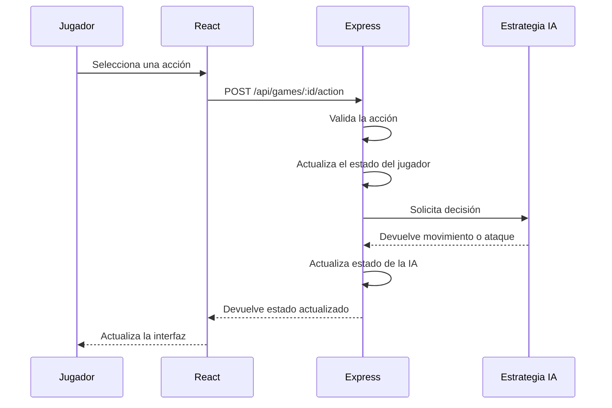
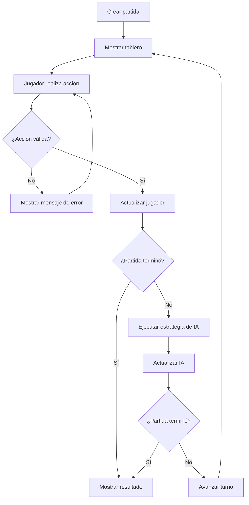

# Arquitectura de Neon Salvaje

## 1. Descripción general

Neon Salvaje utiliza una arquitectura frontend-backend. El frontend está desarrollado con React y TypeScript, mientras que el backend utiliza Express y TypeScript.

El frontend se encarga de mostrar el tablero, recibir las acciones del jugador y actualizar la interfaz. El backend mantiene el estado de la partida, valida las acciones y ejecuta la estrategia de la inteligencia artificial.

## 2. Componentes principales

### Frontend

El frontend contiene la interfaz gráfica del juego y utiliza React para representar el estado actual de la partida.

Entre sus responsabilidades se encuentran:

* Mostrar el tablero.
* Mostrar la posición del jugador y de la IA.
* Mostrar los cristales.
* Mostrar salud, puntuación y turno.
* Permitir al jugador realizar movimientos y ataques.
* Enviar las acciones mediante `fetch`.
* Mostrar los resultados recibidos desde el backend.
* Informar al usuario cuando una acción es inválida o cuando termina la partida.

### Backend

El backend está desarrollado con Express y TypeScript.

Sus principales responsabilidades son:

* Crear nuevas partidas.
* Mantener el estado de las partidas.
* Validar las acciones recibidas.
* Aplicar movimientos y ataques.
* Gestionar los cristales.
* Controlar la salud y puntuación.
* Determinar las condiciones de victoria, derrota y empate.
* Ejecutar la estrategia de la IA.
* Responder las solicitudes HTTP utilizando JSON.

## 3. Comunicación

El frontend se comunica con el backend mediante solicitudes HTTP utilizando la función nativa `fetch`.

Las principales rutas utilizadas son:

| Método | Ruta                    | Función                                                    |
| ------ | ----------------------- | ---------------------------------------------------------- |
| GET    | `/api/health`           | Verificar que la API funciona                              |
| POST   | `/api/games`            | Crear una nueva partida                                    |
| GET    | `/api/games/:id`        | Obtener el estado de una partida                           |
| POST   | `/api/games/:id/action` | Enviar una acción del jugador y ejecutar el turno de la IA |

El flujo principal de una acción es:

## 4. Estado de la partida

El backend mantiene el estado de cada partida en memoria.

El estado incluye:

* Posición del jugador.
* Salud del jugador.
* Puntuación del jugador.
* Posición de la IA.
* Salud de la IA.
* Puntuación de la IA.
* Posición de los cristales.
* Turno actual.
* Cantidad máxima de turnos.
* Estado de la partida.
* Mensaje mostrado al jugador.

Las partidas se almacenan temporalmente mediante una estructura `Map`.

## 5. Estrategia de la IA

La IA se ejecuta en el backend después de cada acción válida del jugador.

Su estrategia sigue estas prioridades:

1. Si el jugador está junto a la IA, intenta atacar.
2. Si no puede atacar, busca acercarse al cristal más cercano.
3. Si no quedan cristales, realiza un movimiento válido aleatorio.

De esta manera, la IA participa realmente en la partida y su lógica no depende exclusivamente del navegador.

## 6. Validación de acciones

El backend valida las acciones antes de modificar el estado.

Por ejemplo:

* No se permite salir del tablero.
* No se permite ocupar la misma casilla que el oponente.
* Solo se puede atacar cuando el enemigo está en una casilla adyacente.
* No se aceptan direcciones desconocidas.
* No se aceptan acciones diferentes de las definidas por el juego.
* No se pueden realizar acciones cuando la partida ya terminó.

Esto evita depender únicamente de las validaciones visuales del frontend.

## 7. Flujo de una partida

## 8. Despliegue

En producción, Express sirve tanto la API como los archivos compilados del frontend.

El frontend se compila mediante Vite y genera los archivos estáticos. Posteriormente, el backend Express sirve estos archivos junto con las rutas `/api`.

La aplicación publicada está disponible en:

**https://neon-salvage.onrender.com**

## 9. Pruebas y automatización

El proyecto utiliza Playwright para las pruebas E2E.

Las pruebas verifican la interacción con la aplicación publicada y comprueban que una acción del jugador genere correctamente una solicitud al backend.

GitHub Actions automatiza tres procesos principales:

* Lint del frontend y backend.
* Pruebas E2E.
* Construcción y publicación de la aplicación.

Esto permite detectar errores antes de publicar cambios en producción.
